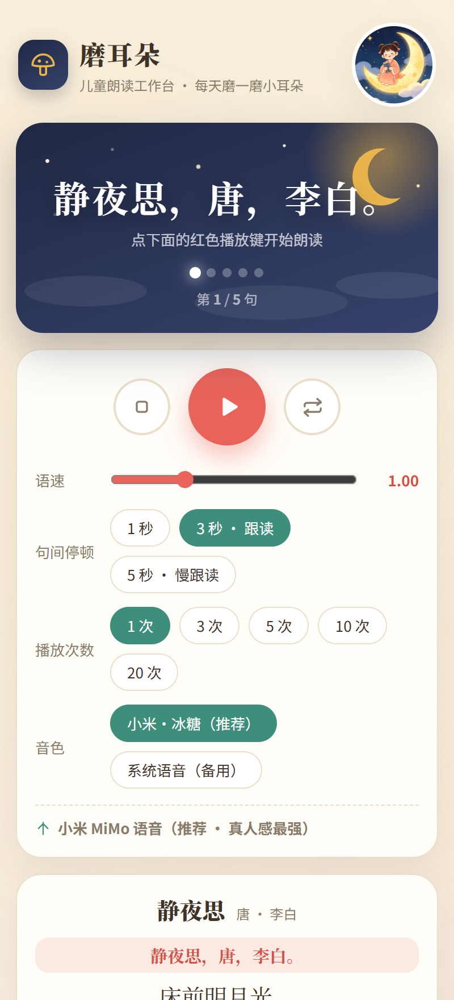
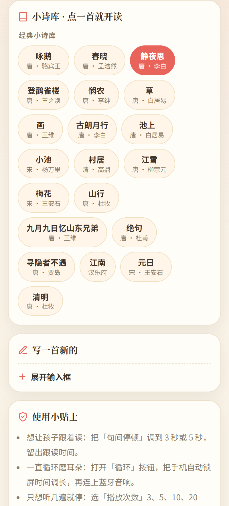
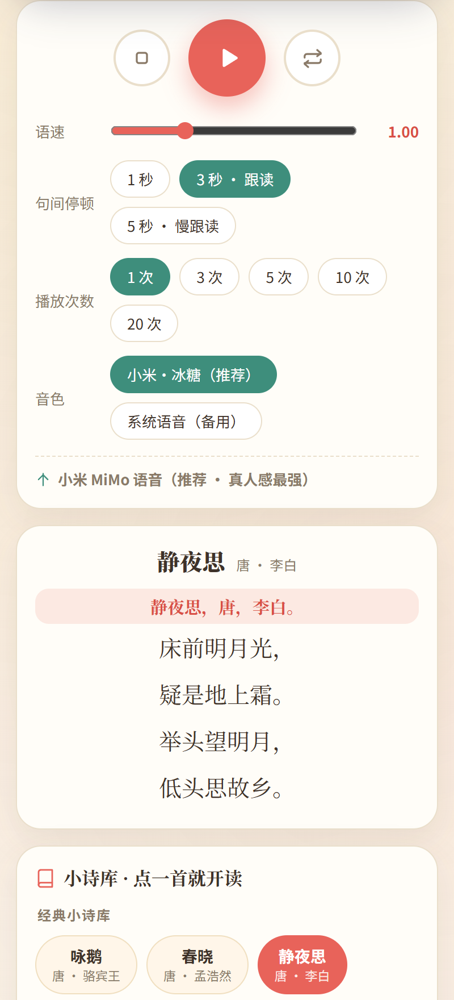

# little-poem-ear · 磨耳朵

给幼儿园小朋友磨耳朵用的古诗词朗读网页。选一首诗点播放，它会一句一句念出来，念正文之前先报诗名、朝代和作者。

整个程序就是一个 `index.html`，没有构建步骤，没有任何依赖，双击就能打开。



## 缘起

家里小朋友要背古诗，大人一遍遍念太费嗓子。做了这个页面让她自己点着听，听多了自然就会了。后来发现「哪一句念不出来」比「念得好不好听」更要命，于是又花了不少功夫在移动端音频这一块。

## 它做了什么

- **逐句朗读**：按标点把诗切成一句一句，念完一句停一下，方便跟读
- **开读先报幕**：念正文之前先说「静夜思，唐，李白。」
- **真人感语音**：接小米 MiMo 的语音合成，用「冰糖」这个温柔女声
- **系统语音兜底**：某一句没连上，只有那一句用系统语音顶上，后面的句子继续走小米，也不会改掉你的设置
- **停顿可调**：句间停顿 1 秒到 5 秒，给小朋友留跟读时间
- **播放次数和循环**：放 1 次到 20 次，或者无限循环当背景音
- **自己加诗**：把诗粘进输入框，一句一行，保存后进「我的小诗」
- 内置 12 首常见启蒙古诗：咏鹅、春晓、登鹳雀楼、悯农、草、静夜思、画、古朗月行、池上、村居、元日、清明



## 怎么用

### 直接打开

下载 `index.html`，双击用浏览器打开。

### 放到手机上

把这个文件丢到任意静态托管上，手机上打开链接，浏览器菜单里选「添加到主屏幕」，下次就像 App 一样点开。用 GitHub Pages 的话，仓库设置里把 Pages 指向根目录即可。

### 本地起个服务

```bash
python -m http.server 8000
```

然后访问 `http://localhost:8000`。

## 关于小米 MiMo 的 API Key

**这个仓库里不含任何 API Key**，需要你自己申请一个填进页面。

1. 打开 platform.xiaomimimo.com，用小米账号登录，没有就先用手机号注册
2. 进左边的「控制台」，找到 **API Keys** 页面
3. 点「新建」，生成的密钥是 `sk-` 开头的一长串
4. **它只在创建那一刻显示一次**，关掉页面就再也看不到了，当场复制存好
5. 回到页面，展开「小米 MiMo 语音」折叠框，粘进去点「保存配置」

没填 Key 也能用，只是会自动退到系统语音，没有小米那么像真人。填上之后再点一下「小米·冰糖」就切回来了。

Key 只存在你自己浏览器的 localStorage 里，不会发往任何第三方。页面上的诊断面板也不会打印 Key 明文。



## 一些踩过的坑

这类「网页逐句念中文」的小工具，最容易死在移动端浏览器的音频策略上。这个项目里真正踩到的：

**不要每句都 `new Audio()`。** 微信内置浏览器会把后创建的实例拦掉，表现就是「第一句能响，第二句开始没声音」。正确做法是全局只留一个 `<audio>` 元素，在用户第一次点击时解锁，之后只换 `src`。

**别用 base64 dataURI 播音频。** TTS 返回的 wav 转成 base64 之后体积很大，某些 WebView 直接播不动。要转成 blob URL 再播。

**预热要趁早。** 用户点开一首诗的时候就在后台把整首合成好，等他点播放时基本不用再等联网。

**降级要做成单句的。** 某一句失败只让那一句用系统语音，不要把整条播放链打断，也不要把用户的音色设置改掉。

**失败要熔断。** 连续几句都连不上就别再重试了，否则用户会对着一个卡住不动的页面发呆。

顺带说一句，最初我把「偶尔失败」当成了「接口限流」，压测跑下来服务端根本没有限流，真正的原因就是上面第一条。

## 已知限制

- 首次朗读每句都要联网合成，大概 1 到 2 秒
- 小米 MiMo 有免费额度，用完了要去控制台充值
- 分词只针对中文古诗调过，英文和其他语言没测

## 协议

MIT
